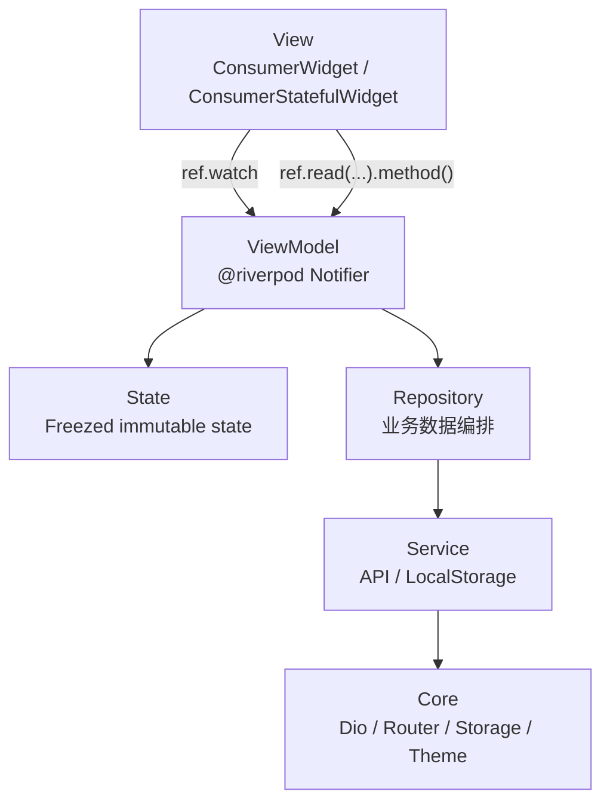

# 趣玩 Flutter

趣玩 Flutter 是一个用于实践 Flutter 前沿技术与移动端工程架构的实验型应用。项目采用 Feature-First 的 MVVM 架构，核心技术栈为 Riverpod、Freezed、GoRouter、Dio 和 SharedPreferences。

本项目重点不只是页面功能展示，更关注一套可持续演进的 Flutter App 工程结构：清晰的模块边界、可测试的数据流、声明式路由、不可变模型，以及集中管理的网络和本地存储能力。

## 相关项目

- 趣玩后端：[interesting-play-service-nest](https://github.com/xt-guiyi/interesting-play-service-nest)
- 趣玩 Android 版：[interesting-play-android](https://github.com/xt-guiyi/interesting-play-android)

## 技术栈

| 类型 | 技术 | 版本 | 说明 |
| --- | --- | --- | --- |
| 状态管理 / DI | `flutter_riverpod`、`riverpod_annotation`、`riverpod_generator` | `^3.3.2` / `^4.0.3` / `^4.0.4` | 使用 `@riverpod` 代码生成风格管理状态和依赖 |
| 路由 | `go_router` | `^17.3.0` | 统一声明式路由表，支持登录守卫和底部 Tab shell |
| 模型 | `freezed`、`freezed_annotation`、`json_serializable`、`json_annotation` | `^3.2.5` / `^3.1.0` / `^6.14.0` / `^4.12.0` | 不可变模型、`copyWith`、JSON 序列化 |
| 网络 | `dio` | `^5.9.2` | 统一 Dio 实例、请求头注入、错误映射 |
| 本地存储 | `shared_preferences` | `^2.5.5` | 通过 `LocalStorageService` 封装 token 和用户信息缓存 |
| UI 组件 | `carousel_slider`、`flutter_staggered_grid_view`、`lottie`、`fl_chart`、`fluttertoast` | `^5.1.2` / `^0.7.0` / `^3.3.3` / `^1.2.0` / `^9.1.0` | 轮播、瀑布流、动画、图表、Toast |
| WebView | `webview_flutter` | `^4.14.0` | 内嵌 WebView，支持进度监听和 JavaScript |
| 扫码 | `mobile_scanner` | `^7.2.0` | 二维码 / 条形码扫描 |
| 二维码生成 | `qr_flutter` | `^4.1.0` | 生成二维码图片 |
| 图片选择 | `image_picker` | `^1.2.2` | 相册/相机图片选取 |
| 文件选择 | `file_picker` | `^3.0.4` | 通用文件选取 |
| 权限 | `permission_handler` | `^12.0.3` | 运行时权限申请封装 |
| 定位 | `geolocator` | `^14.0.3` | GPS 定位 |
| 分享 | `share_plus` | `^13.1.0` | 系统分享弹窗 |
| 路径 | `path_provider` | `^2.1.5` | 获取应用沙盒目录路径 |
| 本地通知 | `flutter_local_notifications` | `^22.0.1` | 本地推送通知 |
| 国际化 | `intl` | `^0.20.2` | 日期格式化等 i18n 能力 |
| 基础规范 | `flutter_lints` | `^6.0.0` | 使用 Flutter 官方 lint 规则保持基础代码质量 |

## 架构概览

项目采用 Feature-First + MVVM 分层：



核心原则：

- View 只负责 UI 渲染和用户交互，不直接访问 Dio 或 SharedPreferences。
- ViewModel 负责页面状态和用户意图处理，例如登录、刷新、加载更多、注销。
- Repository 负责业务数据编排，例如 token 持久化、用户信息缓存、接口结果校验。
- Service 负责具体 API 请求或本地存储访问。
- Core 放全局基础设施，不承载具体业务页面逻辑。
- Shared 放跨 feature 复用的模型、组件和工具。

## 当前目录结构

```text
lib/
├── app.dart                         # MaterialApp.router，注入 GoRouter 和主题
├── main.dart                        # ProviderScope 入口
├── assets/                          # 图片、Lottie 等静态资源
├── core/                            # 核心基础设施
│   ├── constants/
│   │   └── app_constants.dart       # App 常量、请求头 key、baseUrl
│   ├── network/
│   │   ├── api_client.dart          # dioProvider、Dio 创建、拦截器
│   │   ├── api_exception.dart       # HTTP / 业务异常映射
│   │   └── response_result.dart     # 通用响应结构，Freezed 泛型模型
│   ├── router/
│   │   └── app_router.dart          # appRouterProvider、GoRouter 路由表
│   ├── storage/
│   │   └── local_storage.dart       # localStorageServiceProvider、本地缓存封装
│   └── theme/
│       ├── app_colors.dart          # 颜色常量
│       └── app_theme.dart           # ThemeData
├── features/                        # 功能模块
│   ├── auth/                        # 登录与鉴权
│   ├── home/                        # 首页推荐流
│   ├── discover/                    # 发现页 / 瀑布流
│   ├── profile/                     # 个人中心
│   ├── detail/                      # 详情页
│   ├── shell/                       # 底部 Tab 容器
│   ├── public/                      # 公共数据模块（跨页面共享数据）
│   └── practice/                    # Flutter 能力实践集合
│       ├── chat/                    # AI 聊天页（MVVM 完整结构）
│       └── view/                    # 各能力实践页面
│           ├── practice_page.dart               # 实践入口列表页
│           ├── dialog_practice_page.dart        # Dialog 实践
│           ├── bottom_sheet_practice_page.dart  # BottomSheet 实践
│           ├── date_picker_practice_page.dart   # 日期选择器实践
│           ├── year_month_day_picker_practice_page.dart # 年月日选择器实践
│           ├── scan_practice_page.dart          # 扫码实践
│           ├── image_picker_practice_page.dart  # 图片选择实践
│           ├── permission_practice_page.dart    # 权限申请实践
│           ├── location_practice_page.dart      # 定位实践
│           ├── file_picker_practice_page.dart   # 文件选择实践
│           ├── share_practice_page.dart         # 系统分享实践
│           ├── clipboard_practice_page.dart     # 剪切板实践
│           ├── download_practice_page.dart      # 文件下载实践
│           ├── notification_practice_page.dart  # 本地通知实践
│           ├── webview_practice_page.dart       # WebView 实践
│           ├── qr_code_practice_page.dart       # 二维码生成实践
│           └── region_picker_practice_page.dart # 地区选择器实践
└── shared/                          # 跨模块共享能力
    ├── models/                      # 多 feature 复用的数据实体
    ├── utils/                       # 通用工具
    └── widgets/                     # 通用组件
```

项目以 `core/`、`features/`、`shared/` 作为主要组织边界，分别承载基础设施、业务模块和跨模块复用能力。

## Feature 模块结构

一个典型 feature 的结构如下：

```text
features/home/
├── data/
│   ├── home_service.dart            # API 请求封装
│   └── home_repository.dart         # 业务数据编排
├── model/
│   └── home_state.dart              # 页面状态，Freezed
├── view/
│   ├── home_page.dart               # 页面 UI
│   └── components/                  # 仅首页使用的局部组件
└── viewmodel/
    └── home_viewmodel.dart          # 页面状态管理，@riverpod
```

当前模块职责：

| 模块 | 职责 |
| --- | --- |
| `auth` | 登录、token 保存、用户信息获取、鉴权状态 |
| `home` | 首页推荐视频、轮播图、当前用户信息、分页加载 |
| `discover` | 发现页数据、瀑布流列表、刷新和加载更多 |
| `profile` | 个人中心用户信息展示、注销 |
| `detail` | 详情页路由承载 |
| `shell` | `StatefulShellRoute` 的底部 Tab 容器 |
| `public` | 跨页面共享的公共数据（如公共 service） |
| `practice` | Flutter 各平台能力的实践与演示集合 |
| `practice/chat` | AI 聊天页，含完整 MVVM 结构 |

## Core 基础设施

### 网络层

`core/network/api_client.dart` 暴露 `dioProvider`，统一创建 Dio 实例。

网络层包含：

- `BaseOptions`：配置 `baseUrl`、超时时间等。
- `AuthInterceptor` 请求阶段：读取本地 token 并注入请求头。
- `AuthInterceptor` 响应阶段：读取 refresh token 并更新本地 token。
- `ErrorInterceptor`：统一把 Dio 异常转换为 `ApiException`。
- 401 处理：只清理本地登录态，不在拦截器中直接做页面跳转，跳转交给路由守卫和鉴权状态处理。

### 本地存储

`core/storage/local_storage.dart` 暴露 `localStorageServiceProvider`。

`LocalStorageService` 当前负责：

- 读取 / 保存 / 删除 token。
- 读取 / 保存 / 删除 `UserInfo`。
- 注销或 token 失效时清理本地鉴权状态。

页面和 ViewModel 不直接操作 `SharedPreferencesAsync`，统一通过 Repository 间接访问。

### 路由

`core/router/app_router.dart` 暴露 `appRouterProvider`。

当前路由：

| 路径 | 页面 |
| --- | --- |
| `/login` | 登录页 |
| `/` | 首页 Tab |
| `/home` | 首页别名 |
| `/discover` | 发现页 Tab |
| `/profile` | 个人中心 Tab |
| `/detail/:id` | 详情页 |
| `/practice` | 实践入口列表页 |
| `/practice/dialog` | Dialog 实践 |
| `/practice/bottom-sheet` | BottomSheet 实践 |
| `/practice/date-picker` | 日期选择器实践 |
| `/practice/year-month-day-picker` | 年月日选择器实践 |
| `/practice/scan` | 扫码实践 |
| `/practice/image-picker` | 图片选择实践 |
| `/practice/permission` | 权限申请实践 |
| `/practice/location` | 定位实践 |
| `/practice/file-picker` | 文件选择实践 |
| `/practice/share` | 系统分享实践 |
| `/practice/clipboard` | 剪切板实践 |
| `/practice/download` | 文件下载实践 |
| `/practice/notification` | 本地通知实践 |
| `/practice/webview` | WebView 实践 |
| `/practice/qr-code` | 二维码生成实践 |
| `/practice/region-picker` | 地区选择器实践 |
| `/practice/chat` | AI 聊天页 |

路由使用 `StatefulShellRoute.indexedStack` 管理底部 Tab，登录状态由 `authViewModelProvider` 驱动 `redirect`。

## Model 放置规则

项目里的 model 分两类：

### `shared/models`

放跨模块复用的接口实体或通用数据结构，例如：

- `UserInfo`
- `VideoInfo`
- `BannerInfo`
- `CommentInfo`
- `DiscoverInfo`
- `OwnerInfo`
- `PageData`

判断标准：如果两个以上 feature 会直接使用，或者它是后端领域实体，就放到 `shared/models`。

### `features/*/model`

放只属于某个 feature 的状态模型、请求 DTO 或局部数据结构，例如：

- `auth/model/login_dto.dart`
- `auth/model/login_state.dart`
- `home/model/home_state.dart`
- `discover/model/discover_state.dart`
- `profile/model/profile_state.dart`
- `practice/chat/model/chat_state.dart`
- `practice/chat/model/message_item.dart`

判断标准：如果只服务当前页面或当前 feature，不提前放到 shared。只有发生真实复用时再上移。

## Freezed 与生成文件

模型文件旁边通常会出现两类生成文件：

```text
user_info.dart
user_info.freezed.dart
user_info.g.dart
```

- `.freezed.dart`：由 Freezed 生成，提供不可变实现、`copyWith`、`==`、`hashCode`、`toString` 等能力。
- `.g.dart`：由 json_serializable 生成，提供 `fromJson` / `toJson`。

如果一个模型不需要 JSON 序列化，可以只有 `.freezed.dart`。如果不用 Freezed，只使用 json_serializable，则一般只有 `.g.dart`。

## 数据流示例

以登录为例：

```text
LoginPage
  -> ref.read(loginViewModelProvider.notifier).login(phone, password)
  -> LoginViewModel
  -> AuthRepository
  -> AuthService.login()
  -> Dio
  -> 保存 token
  -> 拉取 UserInfo
  -> LocalStorageService 缓存用户信息
  -> AuthViewModel 刷新鉴权状态
  -> GoRouter redirect 进入首页
```

以首页加载为例：

```text
HomePage / TabBarViewType1
  -> HomeViewModel.loadInitial / refresh / loadMore
  -> HomeRepository
  -> HomeService
  -> Dio 请求视频列表和轮播图
  -> ResponseResult / PageData / VideoInfo / BannerInfo
  -> HomeState
  -> UI ref.watch 后自动刷新
```

## 依赖版本策略

当前项目使用 `^x.y.z` 形式声明依赖，并提交 `pubspec.lock`。

含义：

- `pubspec.yaml` 表达允许的兼容升级范围。
- `pubspec.lock` 锁定团队、CI、本机实际安装版本。
- 普通 `flutter pub get` 会优先使用 lock 文件，不会自动漂移到新版本。
- 需要升级时显式运行 `flutter pub upgrade` 或调整依赖约束。

注意：`freezed 4.0.0-dev.1` 当前需要 `analyzer ^13.0.0`，而 `riverpod_generator 4.0.4` 需要 `analyzer ^12.0.0`，二者暂时不可同时解析。因此项目使用当前可解析的最新 Freezed 版本（`^3.2.5`）。

## 常用命令

安装依赖：

```bash
flutter pub get
```

生成 Riverpod / Freezed / JSON 代码：

```bash
dart run build_runner build --delete-conflicting-outputs
```

格式化：

```bash
dart format lib test
```

静态分析：

```bash
flutter analyze
```

运行测试：

```bash
flutter test
```

查看依赖更新：

```bash
flutter pub outdated
```

## 验证状态

当前已通过：

- `dart run build_runner build --delete-conflicting-outputs`
- `dart format lib test`
- `flutter analyze`
- `flutter test`
- `git diff --check`

Flutter 命令可能提示 iOS CocoaPods / Swift Package Manager 集成信息，这是 Flutter 对 iOS 工程配置的提示，不代表 Dart/Flutter 代码分析失败。
